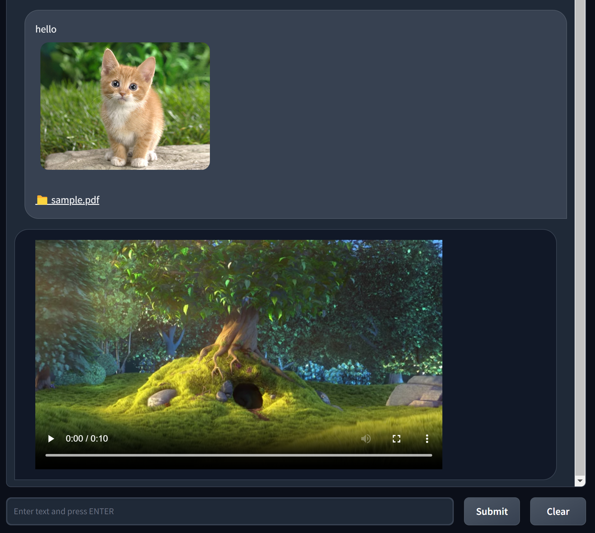

# Multimodal Chatbot
Multimodal Chatbot based on Gradio Template.



## Install

* Create `.env` under the project root folder with `OPENAI_API_KEY`

```
OPENAI_API_KEY=<openai_api_key>
```

* Setup a conda environment and run

```
conda create -n mmchat python=3.10
conda activate mmchat

pip install -r requirement.txt
python app.py
```

* Chat mode:
  * Random: Random generate multimodal bot messages.
  * Stateless: Raw direct API call (no memory support).
  * Stateful: Normal Chatbot (Prompt + Memory).